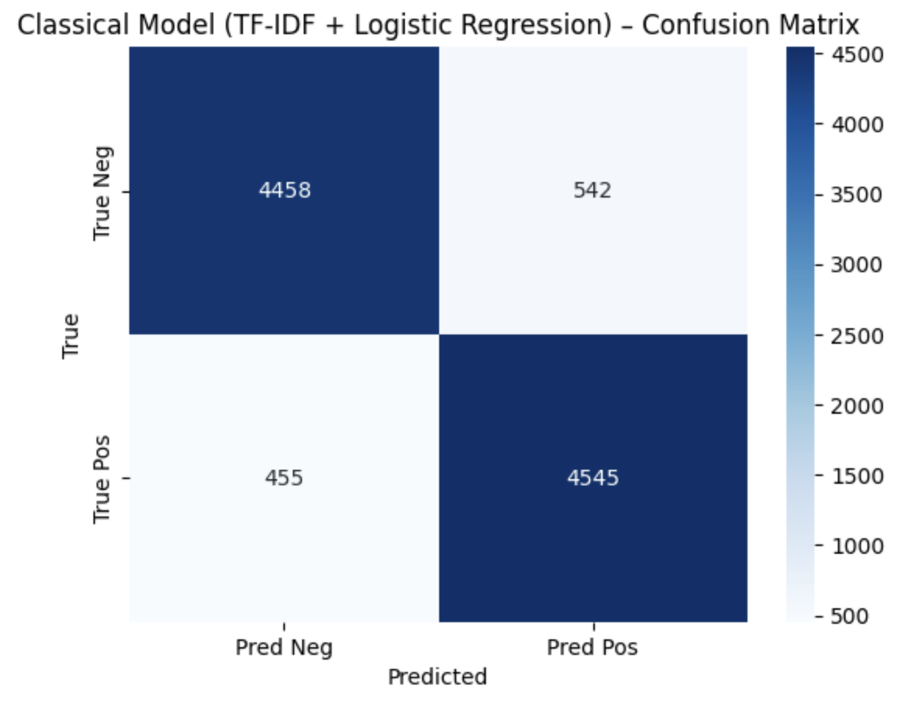
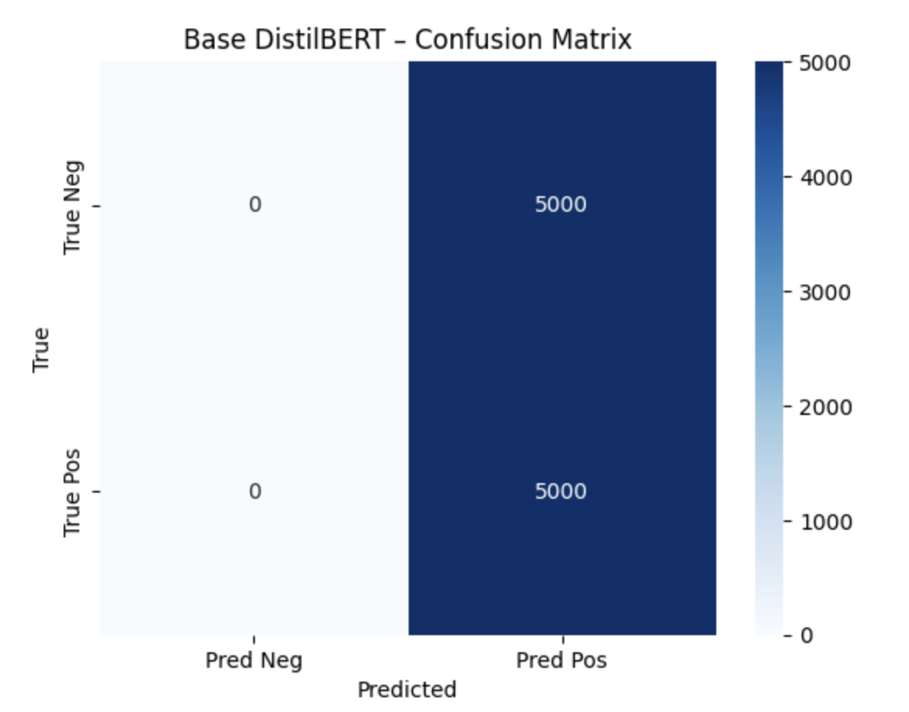
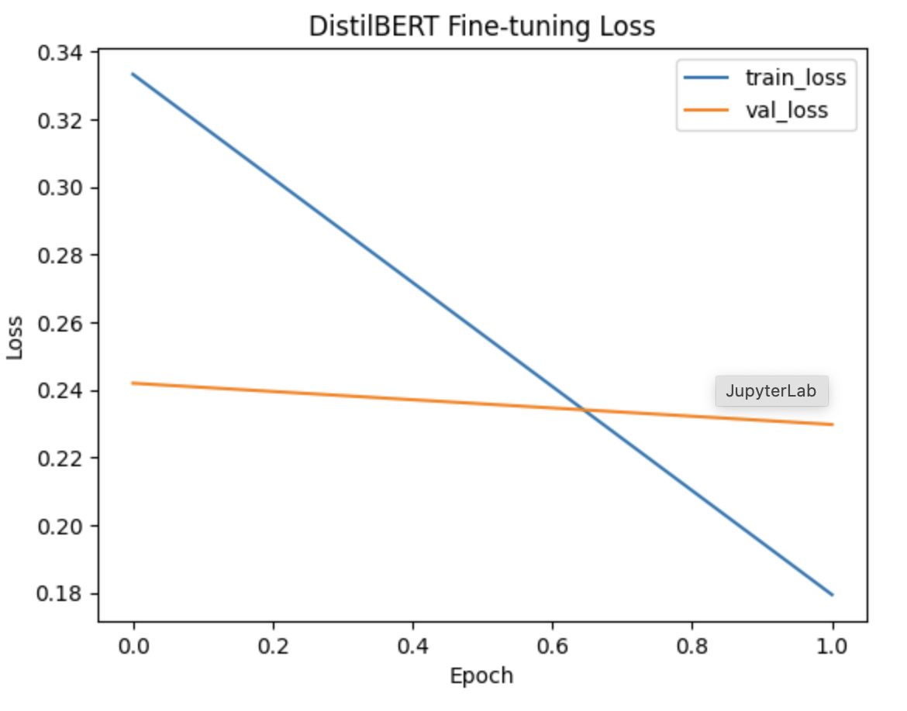
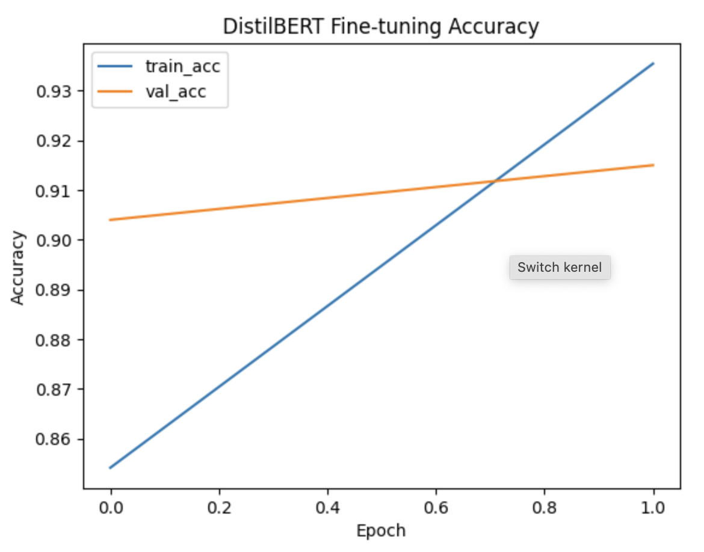
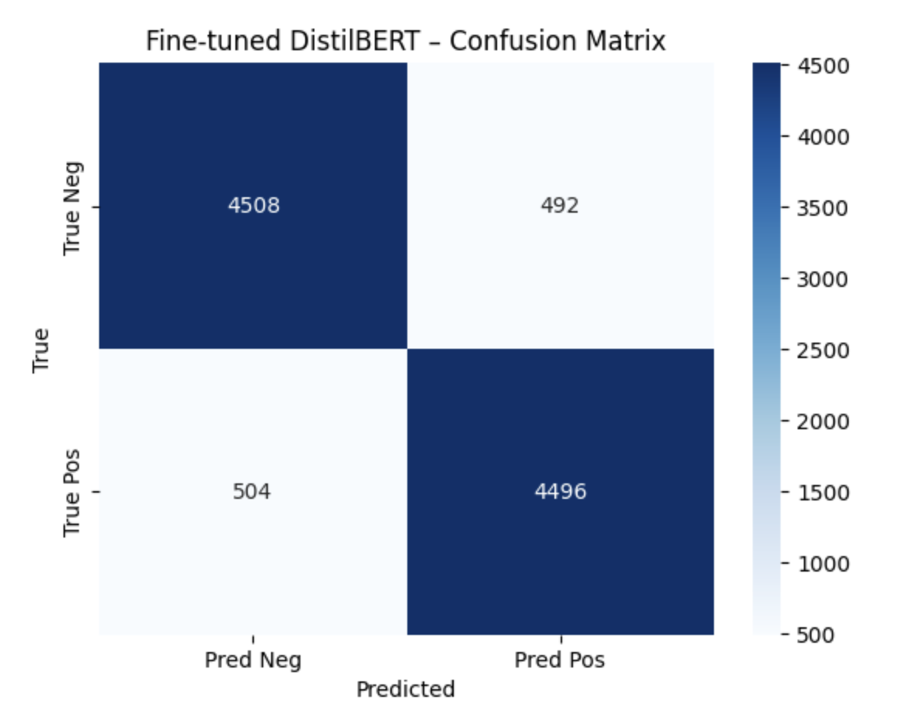
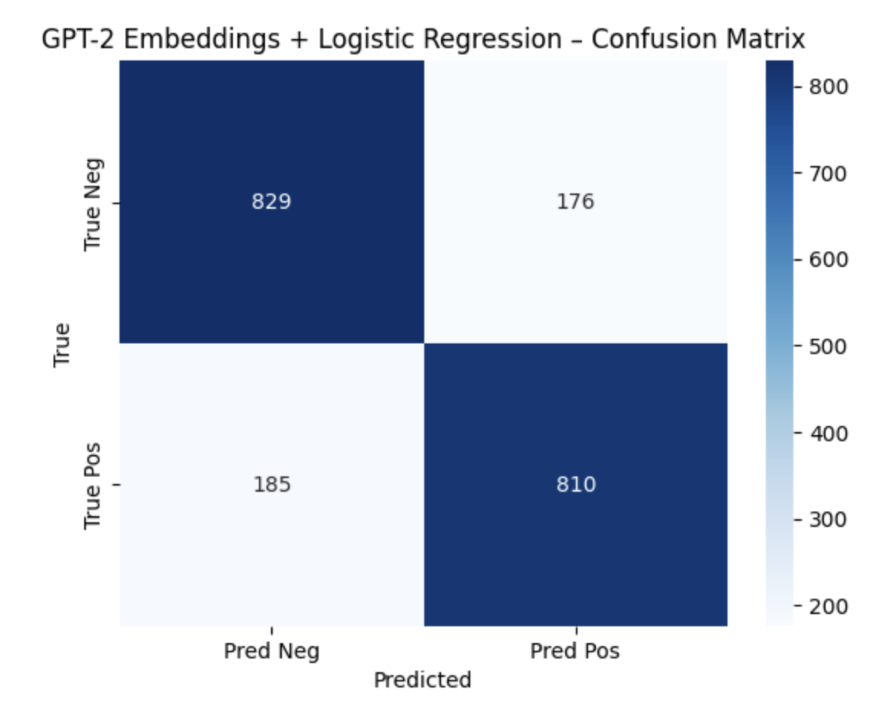
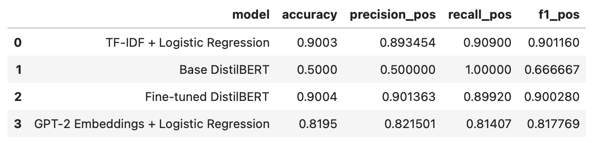
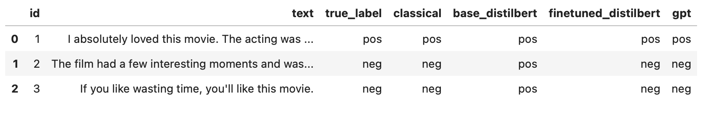

# CSCE 580 – Project B  
**Why and When to Use LLMs for Classification on the IMDB Movie Review Dataset**

Author: Charlotte Baker 
Due Date: 11/20/2025

---

## 1. Dataset and Preprocessing

For this project we used the IMDB Movie Review dataset from Kaggle. It contains 50,000 movie reviews, each having 'review' which is the text of the review, and 'sentiment' the positive or negative label. The dataset is perfectly balanced with 25,000 positive and 25,000 negative reviews. This balance makes accuracy directly interpretable.

#### Splitting

I first converted the sentiment labels to 0 for negative, 1 for positive and then did an 80/20 split of 40,000 training data reviews, and 10,000 test data reviews. I used `train_test_split` with `stratify=y` so the class balance is kept in both splits.

For DistilBERT fine-tuning I split the training set again, taking a subset of 10,000 reviews for speed. This was then split again into 9,000 training revies and 1,000 validation reviews. The validation subset was used to monitor training and choose the number of epochs.

## 2. Classical Machine Learning Baseline

As a classical baseline, I trained a logistic regression classifier on TF–IDF representations of the reviews. The text was vectorized using scikit-learn’s TfidfVectorizer with a maximum vocabulary of 20,000 features, including unigrams and bigrams (ngram_range = (1, 2)) and removing English stopwords, producing sparse vectors that capture the relative importance of each word or word pair. The logistic regression model (max_iter = 1000, using all CPU cores) achieves 0.9003 accuracy on the 10,000-review test set. For the positive class, precision, recall, and F1 scores are 0.8935, 0.9090, and 0.9012, respectively, indicating a strong, slightly recall-oriented baseline without any deep learning. The confusion matrix is strongly diagonal, with relatively few false positives and false negatives.

## 3. DistilBERT Base vs Fine-Tuned

Next, I experimented with DistilBERT using the distilbert-base-uncased model from HuggingFace. I considered the base model without any task-specific training and a fine-tuned version. 

#### Base DistilBERT (no fine-tuning)

For the base model, I loaded DistilBertForSequenceClassification with two output labels and evaluated it on the test set without training. As expected from the warning about randomly initialized classifier weights, this model performed poorly. It achieved 0.5000 accuracy, positive precision 0.5000, positive recall 1.0000 and positive F1 0.6667. The confusion matrix shows that the model predicts all of the 10,000 test reviews as positive with 5000 true and 5000 false positives. This is what we would expect from a model that has not yet learned the task and is effectively guessing the majority class. 

#### Fine-tuned DistilBERT

To obtain a meaningful DistilBERT model, I fine-tuned distilbert-base-uncased on the IMDB training subset. I did this using the fast tokenizer with a mazimum sequence length of 256 tokens, truncation, and padding to a fixed length. The model was trained for two epochs using AdamW with a learning rate of 2e-5, a batch size of 16 for training and 32 for evaluation, and cross-entropy loss.

During fine-tuning, I tracked loss and accuracy on the training and validation sets. Over two epochs the training loss  decreases from roughly 0.34 to about 0.18, while the validation loss decreases slightly from roughly 0.24 to 0.23. The training accuracy rises feom about 85% to 94% and the validation went from about 90% to 92%. The training and validation curves stay close togetrher and the validation loss doesnt start increasing. This suggests that the model is learning useful patterns and has not yet started to overfit.

When evaluated on the full 10,000 review test set, the fine tuned distilbert model achieved an accuracy of 0.9004. FOr the positive class, its precision is 0.9014, recall is 0.8992, and F1 is 0.9003. These numbers are almost identical to the TF-IDF baseline, with only slight improvement in positive-class precision. The confusion matrix for the fine-tuned model is strongly diagonal with only a few off-diagonal entries, showing there were only a small amount of misclassifications.

## 4. GPT2 Embeddings and Logistic Regression

For the GPT model, I used the small GPT-2 model as a feature extractor and trained another logistic regression classifier on top of its embeddings. Becuase GPT2 doesn't define a pad token by default, I reused its end of sequence token as the padding token and updated the model config. I tokenized each review with a maximum length of 128 tokens, fed the batch to GPT-2, took the last hidden state, and averaged over the sequence dimension to get a 768 dimensional embedding for each review.

Since embedding all 40,000 training and 10,000 test reviews would be extremely slow on my laptop, I used a smaller set of 4,000 training reviews and 2,000 test reviews. I calculated embeddings for this subset and trained logistic regression with 1000 maximum iterations on the 4,000 training embeddings.

On the 2,000 review test set, the GPT model achieves an accuracy of 0.8195. For the positive class its precision is 0.8215, recall is 0.8141, and F1 is 0.8178. The confusion matrix is mostly diagonal but with more off-diagonal entries than either the classical model or the fine-tuned Distilbert model. There are 829 true negatives, 810 true positives, and roughly 180 false positives and false negatives each. 

## 5. Quantitative Comparison and Time Complexity

To compare the four models even more directly I collected the accuracy and positive class precision, recall, and F1 from each classification report. The resulting table is:

This table shows a clear pattern. The base distilbert model without any fine-tuning is essentially a majority-class classifier with 50% accuracy. The classical TF-IDF and Logistic Regression model and the fine-tuned DistilBERT model are almost tied around 90% accuracy and very similar F1 scores, with the fine-tuned DistilBERT slightly improving positive precision. The GPT-2 model is in the middle at about 82% accuracy, better than base DistilBERT but not as strong as the classical and fine-tuned models, and trained on a smaller subset. 

Timing measurements show that the TF-IDF and Logistic Regression baseline trains on the full 40,000 training set in a few seconds and can classify 1,000 reviews in a fraction of a second. For GPT-2, computing embeddings for 6,000 reviews takes about 201.79 seconds, while training the classifier takes 3.05 seconds and predicting 500 embedded reviews takes about 0.0018 seconds, so the cost is dominated by embedding. Fine-tuning DistilBERT for two epochs on 9,000 examples takes several minutes, and inference on the 10,000-review test set does it in around 30 seconds. The base DistilBERT model has similar runtime but much worse accuracy. Overall, the classical model is by far the most computationally efficient, while fine-tuned DistilBERT and GPT-2 are substantially heavier and offer different accuracy–cost trade-offs.

## 6. AI Testcases (GAICO)

Beyond the collected metrics, I created 3 small AI testcases to test the behavior of the models. Each testcase consists of a short review, an intended ground truth label, and the predictions of all four models. I used the TF-IDF + Logistic Regression model as the statistical baseline, and then compared the base DistilBERT, fine-tuned DistilBERT, and GPT-2 classifiers against it. 

The three testcases were:

1. A clearly positive review: “I absolutely loved this movie. The acting was brilliant and I left the theater smiling.”  

2. A mixed but overall negative review: “The film had a few interesting moments, but overall it was boring and far too long.”  

3. A short sarcastic negative review: “If you like wasting time, you’ll like this movie.” 

I ran each text through all four models using a helper function in the notebook. The results from the testcases_df table were:

- For the first, clearly positive review, all four models correctly predicted positive.  

- For the second and third reviews, which are both negative, the TF-IDF baseline, the fine-tuned DistilBERT model, and the GPT-2 model all predicted negative, while the base DistilBERT model predicted positive in both cases. 

In the GAICO framework, the goal of the second and third testcases was to check whether the models can handle mixed sentiment and sarcasm rather than only obvious examples. The input sentences contain either a mix of mild praise and stronger criticism or a sarcastic “recommendation” that actually implies a waste of time. Comparing outputs, the classical baseline, fine-tuned DistilBERT, and GPT-2 agree with the intended labels, while the base DistilBERT model fails and defaults to the positive class. The observation from these testcases is consistent with the confusion matrices: the unfine-tuned DistilBERT model is heavily biased toward predicting positive, whereas the other three models handle these more nuanced examples correctly. The results are included in a table below:

## 7. Assigned Questions

1. The curves show that fine-tuning is working and not obviously overfitting. Over the two epochs, training loss drops from about 0.34 to about 0.18, while validation loss decreases very slightly from around 0.24 to about 0.23. At the same time, training accuracy increases from roughly 85% to about 94%, and validation accuracy increases from about 90% to around 92%. The training and validation lines stay close together and the validation loss does not turn upward, which suggests the model is still learning useful patterns and has not started to memorize the training data.

2. On this dataset, fine-tuned DistilBERT and the classical TF-IDF + Logistic Regression baseline perform almost the same. Both reach about 90% test accuracy and very similar F1-scores for the positive class. Fine-tuned DistilBERT is slightly better on positive precision, but the gap is small.

The main advantage of DistilBERT is that it automatically learns contextual representations of the text, taking the word order and the surrounding words into account. That can be powerful on more complex language tasks. The downside is that transformers are more difficult to implement, train, and run. The classical TF-IDF + Logistic Regression model is simple and easy to deploy on a CPU, and in this case it matches the transformer’s performance.

3. The base DistilBERT confusion matrix showed a very clear pattern, it predicted almost every review as positive. That produces 50% accuracy on the balanced test set, with 5,000 true positives and 5,000 false positives and essentially no true negatives. This confirms that the base model is not really solving the task.

The classical TF-IDF model, the GPT-2 model, and the fine-tuned distilBERT model all have diagonal-dominant confusion matrices, meaning most predictions are correct for both classes. Among these, fine-tuned DistilBERT has the cleanest diagonal and the fewest off-diagonal entries, so it makes the fewest false positives and false negatives. When the stronger models do make mistakes, they tend to be on borderline or tricky reviews, such as the sarcastic one, rather than on obviously positive or negative ones.

4. The base DistilBERT model uses a randomly initialized classification head that has not been trained on IMDB sentiment labels. Its encoder has seen a lot of general text during pretraining, but it has not learned how to map those representations into positive or negative for movie reviews. Fine-tuning updates the classification head and, to some extent, the encoder weights using labeled IMDB data. This aligns the internal representations with the sentiment task, so the model learns which patterns correspond to positive vs. negative reviews. That extra supervised training is why the fine-tuned model jumps from about 50% accuracy to around 90%.

5. I would recommend deploying the fine-tuned DistilBERT model. It achieves the best or tied-best accuracy (about 90%), has a very balanced confusion matrix, and handles tricky cases like mixed and sarcastic reviews well. However, if efficiency and simplicity are the main constraints, the TF-IDF + Logistic Regression model could also be a good choice. It trains on the full dataset in a few seconds, does inference almost instantly on CPU, and still reaches about 90% accuracy. The GPT-2 embeddings and logistic regression model is more expensive than the classical baseline because of the embedding step and is less accurate than fine-tuned DistilBERT so it does not offer the best trade-off. The base DistilBERT model is clearly not the choice for deployment because it behaves like a majority-class classifier with only 50% accuracy.

## 8. Conclusion

In this project, I built and compared four sentiment classifiers on the IMDB movie review dataset. A TF-IDF and Logistic Regression baseline, a base DistilBERT model, a fine-tuned DistilBERT model, and a GPT-2 embeddings and Logistic Regression model. The results have shown that pretrained transformers need fine-tuning to be useful. Overall, the confusion matrices, training curves, timing results, and custom testcases highlight the trade-offs between accuracy and efficiency when choosing between classical models and large language models for text classification. Working through this project has helped me to learn about training models and when different models make sense. 
